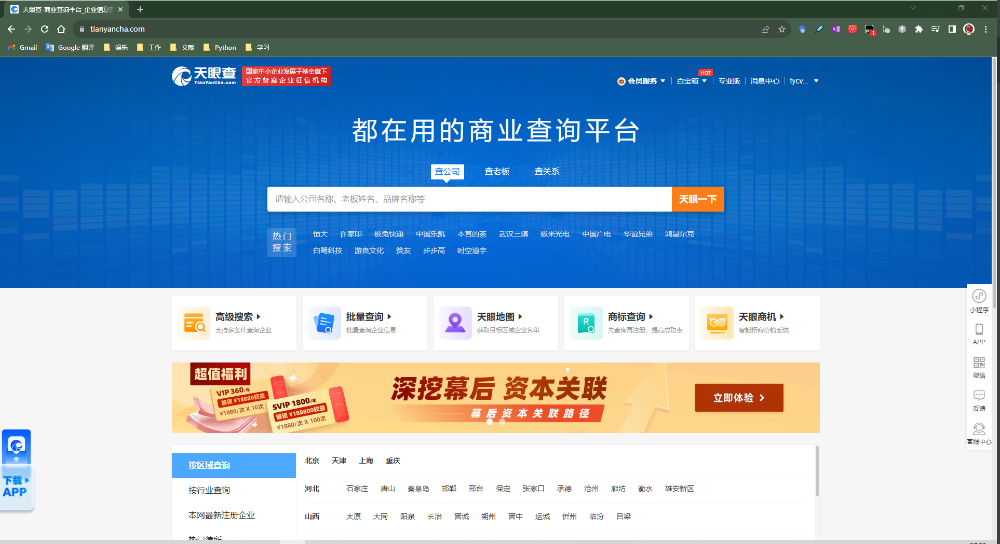

# 基于Python爬虫搜索公司信息工具使用指南

## 1.环境要求：

该工具需要如下软件包需要通过pip命令下载，用户在配置好的python终端中输入如下指令

```
pip install requests
pip install Beautifulsoup
pip install cpca
pip install csv
pip install os
pip install xlwt
```

即可开始准备开始使用工具

## 2.cookie与User-Agent修改指南

在使用该工具之前用户需要根据自己的电脑浏览器的相关参数对cookie以及User-Agent进行修改，这里将展示基于Chrome浏览器的cookie与User-Agent获取

**1.打开天眼查网页，得到如下界面：**




然后点击鼠标右键，点击检查按钮，得到如下界面：


在该界面点击Network以及Doc选项（用红圈标注）


然后使用 **Ctrl+R**刷新网页得到如下界面


在该界面下单击 **https://www.tianyancha.com/** ，按照下图指使得到Cookie以及User-Agent参数


然后将程序中hearders的部分中的两个参数替换即可


## 3.使用步骤

**a.将自己所需要查找的公司名称复制找company.txt文件中，注意每一行只能有一个公司名字**

**b.运行程序**

**c.若出现了错误字样“网络连接错误！！！请检查Cookie，User-Agent是否设置正确！！！,或者被网页拦截请打开网页重新认证”，请检查步骤2是否正确，或者用浏览器打开网页人工搜索一下然后完成人工认证信息，可能的原因是多次搜索后被网络拦截需要人工认证后才可以继续**

**d.”若出现了该公司或者学院名称不符合查找表格标准，需要用户手动查找添加，查找的关键词为XXX“的字样则说明该公司的表格信息不符合爬虫要求，需要用户手动搜索添加相关信息。**

**e.完成程序执行后，在excel文件夹下得到最后输出结果，输出结果包括如下几列：**

| 全称备注 | 注册资本 | 公司属地 | 公司地址 | 天眼查网址 |
| -------- | -------- | -------- | -------- | ---------- |
|          |          |          |          |            |
